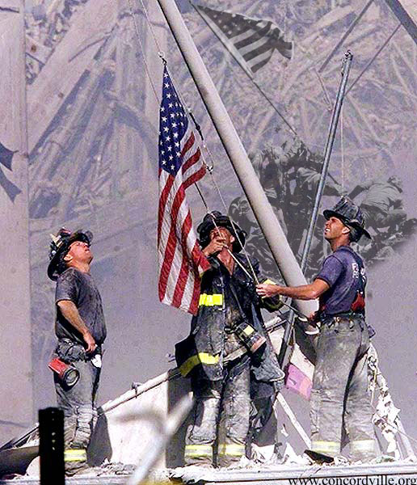
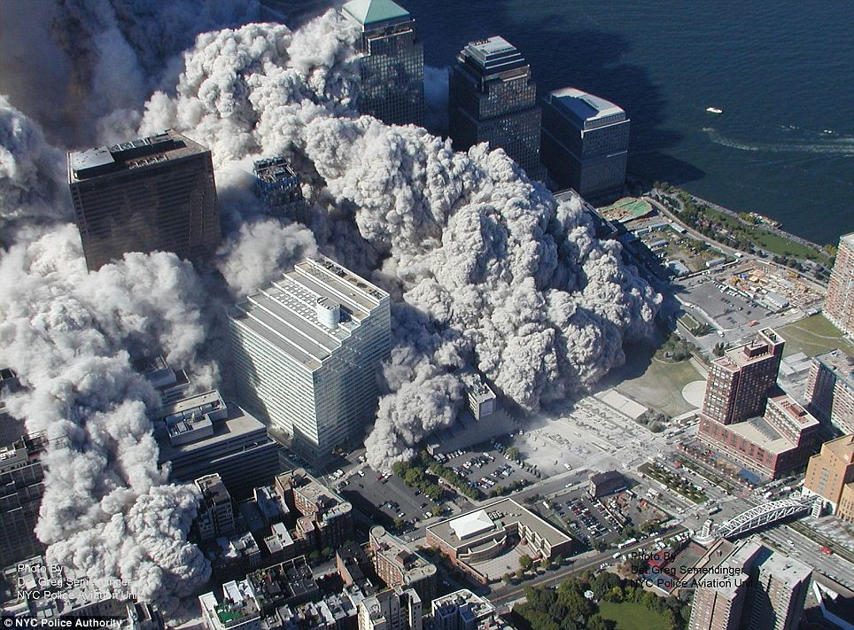

4: The attacks on 9\11
**********************

Synopsis
========

On September 11, 2001 the U.S. attacked by terrorists.

These events were totally unexpected, and completely shocked the nation.

Al-Qaeda claims responsibility for the attacks.

Their justification is:

* The U.S. support of Israel, who they have issues with.
* The presence of American Troops in Saudi Arabia
* U.S. sanction against Iraq.

It was a four sided attack:

* Pentagon
* World Trade Center North Tower
* World Trade Center South Tower
* White House (failed)

What effects did it have?
=========================

After the attacks were carried out, violence and intolerance were carried
out against Muslims - for being Muslim.

Some called for war against a Muslim country, for retribution.

Eventually they got it, with the wars against both Afghanistan and Iraq.

What happened to the country on 9/11 even lead to political assassinations (Bin Laden),
and public executions (Sadaam Husseinn).

Now the U.S. is involved in the longest on going war that it has *ever* seen since.

Media
=====

A couple of firemen hoist the American flag amid the rubble.

Rolling clouds of smoke and debris stalk the streets of New York.

